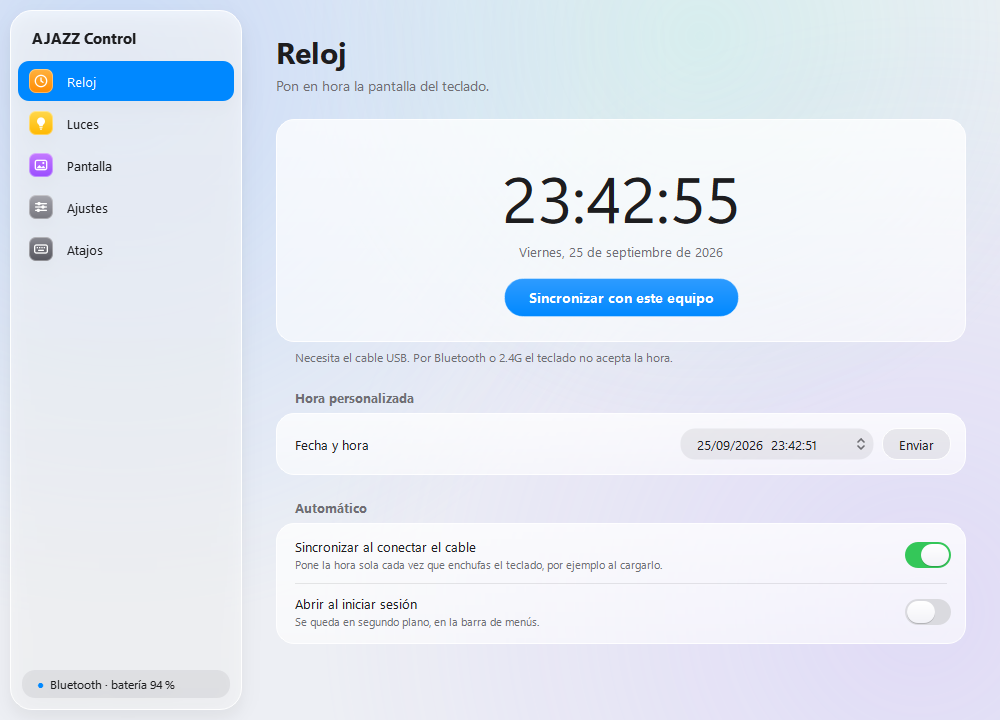
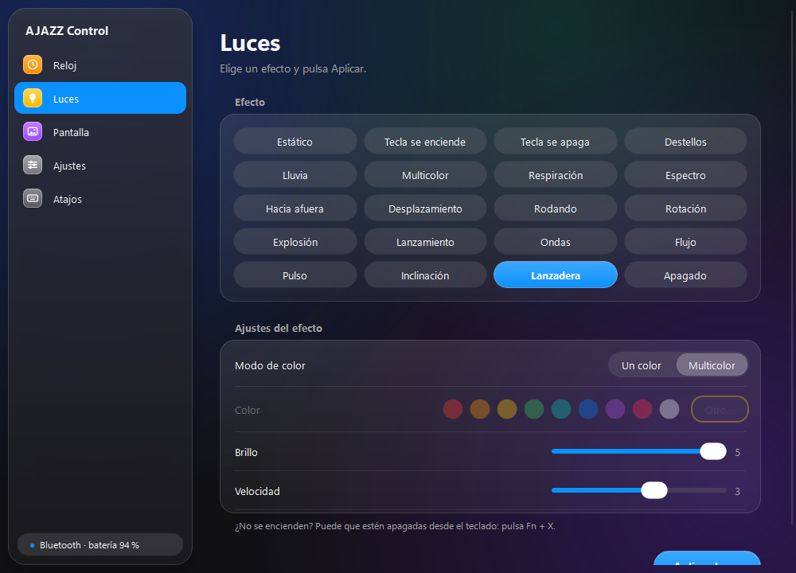
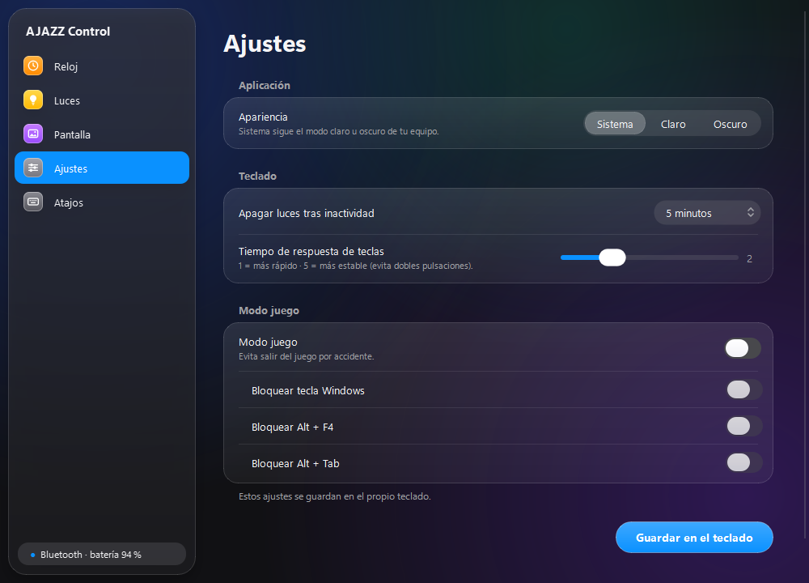

# AJAZZ AK832 Pro Control

App de código abierto para el teclado **AJAZZ AK832 Pro** en **macOS y Windows**, sin el driver oficial.
Pone la hora de la pantalla, cambia las luces, sube imágenes o GIFs a la pantallita y guarda los ajustes del teclado.

<p align="center">
  
  
</p>
<p align="center">
  
  
</p>

| Sección | Qué hace |
|---|---|
| **Reloj** | Pone la hora del teclado (la de tu equipo o una que elijas). Puede sincronizarla sola cada vez que conectas el cable. |
| **Luces** | Los 19 efectos del driver y "Apagado", con color, brillo, velocidad y dirección. |
| **Pantalla** | Sube una imagen o un GIF animado (hasta 255 cuadros) a la pantalla de 160×96. |
| **Ajustes** | Apagado de luces por inactividad, tiempo de respuesta de teclas, modo juego y apariencia. |
| **Atajos** | Las combinaciones Fn del teclado. |

- Diseño inspirado en **Liquid Glass** (macOS 26), con modo claro y oscuro que sigue al sistema o se elige a mano.
- La barra lateral muestra si el teclado está conectado y, por Bluetooth, su **batería**.
- Se puede quedar en segundo plano y abrirse al iniciar sesión.

> [!IMPORTANT]
> Para configurar el teclado hay que conectarlo **con el cable USB**. Por Bluetooth o por el receptor 2.4G el
> teclado no expone el canal de configuración (tampoco funciona con el driver oficial).

## Instalación

### macOS

1. Instala Python 3 desde <https://www.python.org/downloads/macos/>.
2. Descarga este repositorio (botón **Code → Download ZIP**) y descomprímelo.
3. En **Terminal**, escribe `bash ` (con un espacio), arrastra `build_mac.sh` a la ventana y pulsa Enter.
4. Se crea `dist/AJAZZ Control.app`. Muévela a **Aplicaciones** y ábrela la primera vez con **clic derecho → Abrir**
   (no está firmada por Apple).

Si dice que no puede abrir el teclado: **Ajustes del Sistema → Privacidad y seguridad → Monitorización de entrada**
y activa *AJAZZ Control*.

### Windows

Ejecuta `build_windows.bat` (necesita Python 3). El programa queda en `dist\AJAZZ Control\AJAZZ Control.exe`.

Cierra el driver oficial de AJAZZ mientras usas la app: si están abiertos los dos, los comandos se mezclan.

### Desde el código

```bash
python3 -m venv .venv
source .venv/bin/activate        # Windows: .venv\Scripts\activate
pip install -r requirements.txt
python ajazz_control.py
```

## Consejos

- ¿Las luces no se encienden después de aplicar un efecto? Están apagadas desde el teclado: pulsa **Fn + X**.
- Subir una imagen **reemplaza** la animación de la pantalla. Para ver solo el reloj y el estado, ocúltala con **Fn + Supr**.
- Activa *Sincronizar al conectar el cable* y *Abrir al iniciar sesión*: el reloj se pondrá en hora cada vez que cargues el teclado.

## Línea de comandos

```bash
python3 ak832cli.py hora
python3 ak832cli.py luces breath 00ffcc --brillo 4 --velocidad 2
python3 ak832cli.py pantalla mi_gif.gif --ajuste fit
python3 ak832cli.py ajustes --sleep 2 --respuesta 2
```

## Cómo funciona

El protocolo se obtuvo analizando el driver oficial de Windows (`DeviceDriver.exe` V1.0) y se probó en un
AK832 Pro real (VID `05AC`, PID `024F`). Todo va por HID con [hidapi](https://github.com/trezor/cython-hidapi):

| Interfaz | Uso | Transporte |
|---|---|---|
| 3 (usage page `0xFF13`) | Hora, luces y ajustes | Feature reports de 65 bytes |
| 2 (usage page `0xFF68`) | Imágenes de la pantalla | Output reports de 4097 bytes, RGB565 |

Cada comando va en una secuencia `18` (inicio) → comando (`28` hora, `13` luces, `17` ajustes, `72` imagen) → datos
→ `02` (guardar). Los bytes exactos están documentados en [`ak832/protocol.py`](ak832/protocol.py).

Por Bluetooth solo se lee la batería (servicio GATT estándar `0x180F`). El servicio propio del fabricante (`FEE0`)
acepta escrituras pero ignora los comandos de configuración.

**Pendiente de verificar:** qué byte bloquea cada tecla en el modo juego (Win, Alt+F4, Alt+Tab); el orden se dedujo
de la interfaz del driver. La lectura de batería en macOS (vía `ioreg`) no se ha probado.

## Aviso

Proyecto no oficial, sin relación con AJAZZ. Úsalo bajo tu responsabilidad.

## Licencia

[MIT](LICENSE)
