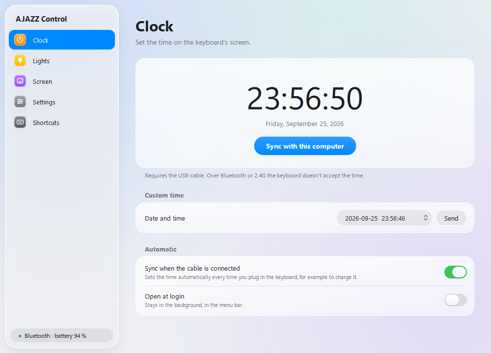
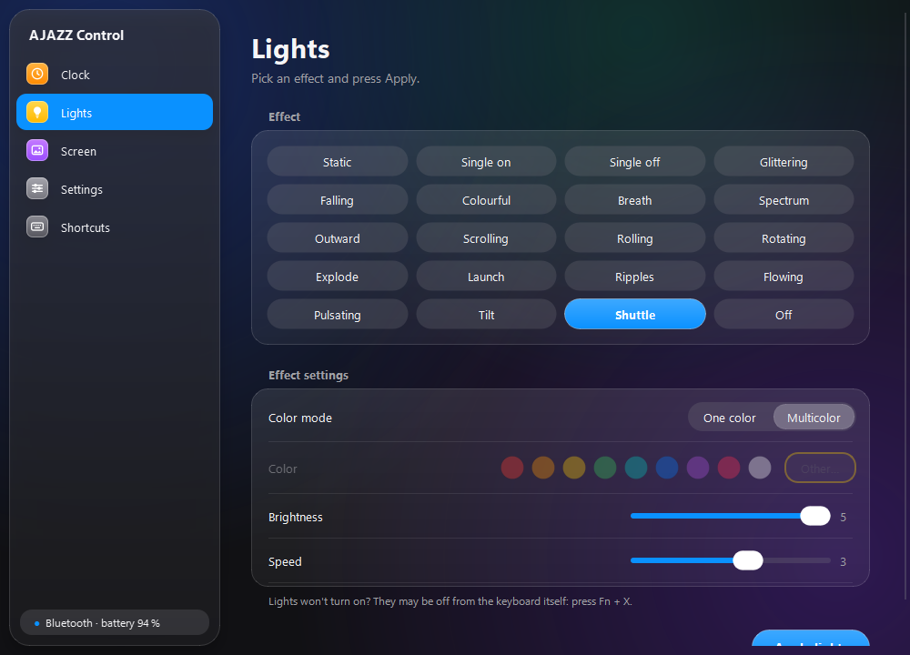
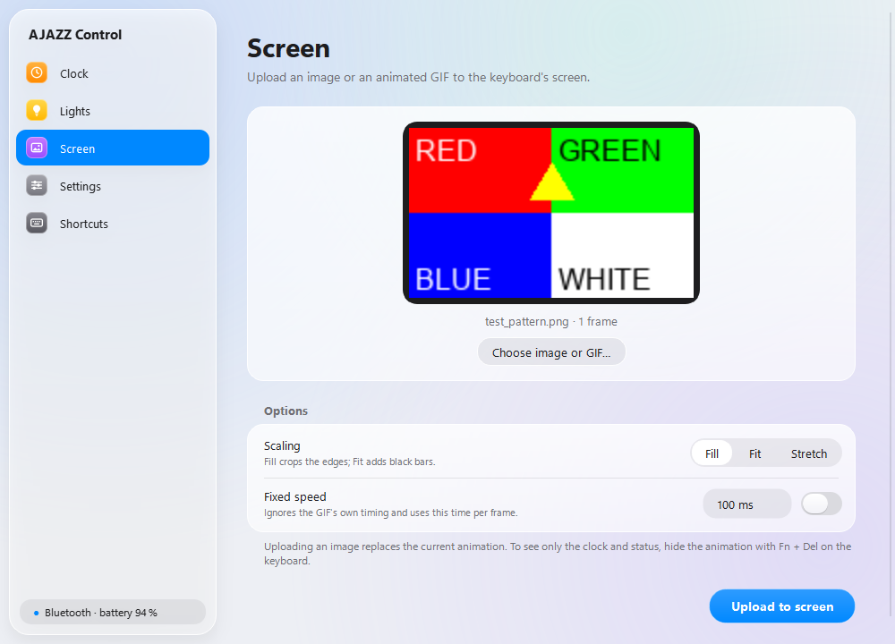
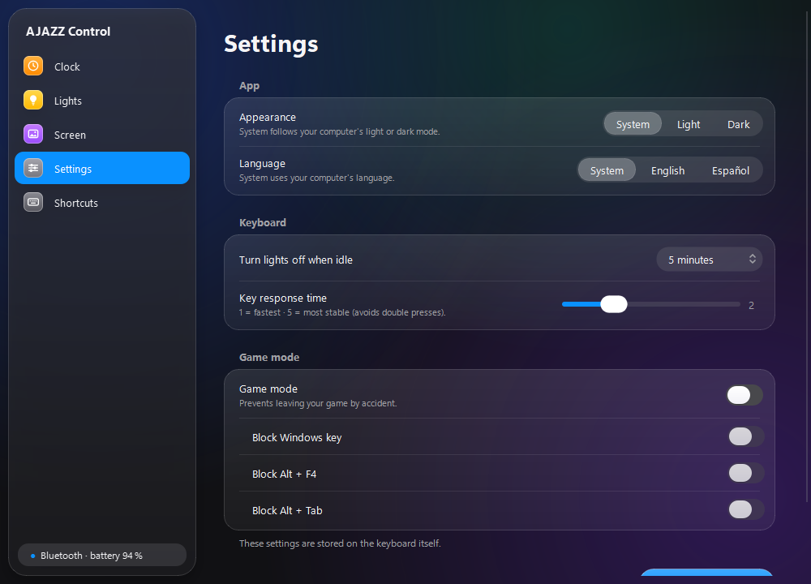

# AJAZZ AK832 Pro Control

Open-source app for the **AJAZZ AK832 Pro** keyboard on **macOS and Windows**, no official driver needed.
Set the clock on its screen, change the lighting, upload images or GIFs to the little display, and save the
keyboard's settings.

<p align="center">
  
  
</p>
<p align="center">
  
  
</p>

| Section | What it does |
|---|---|
| **Clock** | Sets the keyboard's time (your computer's, or one you pick). Can sync it automatically every time you plug in the cable. |
| **Lights** | The driver's 19 effects plus "Off", with color, brightness, speed and direction. |
| **Screen** | Uploads an image or animated GIF (up to 255 frames) to the 160×96 display. |
| **Settings** | Turn lights off when idle, key response time, game mode, appearance and language. |
| **Shortcuts** | The keyboard's Fn key combinations. |

- Design inspired by **Liquid Glass** (macOS 26), with light and dark mode that follow the system or can be set manually.
- **English and Spanish**: the app follows your system language, or you can pick one in Settings.
- The sidebar shows whether the keyboard is connected and, over Bluetooth, its **battery level**.
- It can stay in the background and open at login.

> [!IMPORTANT]
> To configure the keyboard it must be connected **with the USB cable**. Over Bluetooth or the 2.4G receiver the
> keyboard doesn't expose its configuration channel (the official driver doesn't work that way either).

## Installation

### macOS

1. Install Python 3 from <https://www.python.org/downloads/macos/>.
2. Download this repository (**Code → Download ZIP**) and unzip it.
3. In **Terminal**, type `bash ` (with a trailing space), drag `build_mac.sh` into the window and press Enter.
4. This creates `dist/AJAZZ Control.app`. Move it to **Applications** and open it the first time with
   **right-click → Open** (it isn't signed by Apple).

If it says it can't open the keyboard: **System Settings → Privacy & Security → Input Monitoring** and enable
*AJAZZ Control*.

### Windows

Run `build_windows.bat` (requires Python 3). The app ends up in `dist\AJAZZ Control\AJAZZ Control.exe`.

Close the official AJAZZ driver while using the app: if both are open, their commands get mixed up.

### From source

```bash
python3 -m venv .venv
source .venv/bin/activate        # Windows: .venv\Scripts\activate
pip install -r requirements.txt
python ajazz_control.py
```

## Tips

- Lights don't turn on after applying an effect? They're switched off on the keyboard itself: press **Fn + X**.
- Uploading an image **replaces** the screen's animation. To see only the clock and status, hide it with **Fn + Del**.
- Turn on *Sync when the cable is connected* and *Open at login*: the clock will be set every time you charge the keyboard.

## Command line

```bash
python3 ak832cli.py time
python3 ak832cli.py lights breath 00ffcc --brightness 4 --speed 2
python3 ak832cli.py screen my.gif --scaling fit
python3 ak832cli.py settings --sleep 2 --response 2
```

## How it works

The protocol was obtained by analyzing the official Windows driver (`DeviceDriver.exe` V1.0) and verified on a
real AK832 Pro (VID `05AC`, PID `024F`). Everything goes over HID using [hidapi](https://github.com/trezor/cython-hidapi):

| Interface | Used for | Transport |
|---|---|---|
| 3 (usage page `0xFF13`) | Time, lights and settings | 65-byte feature reports |
| 2 (usage page `0xFF68`) | Screen images | 4097-byte output reports, RGB565 |

Each command is a sequence: `18` (start) → command (`28` time, `13` lights, `17` settings, `72` image) → data
→ `02` (save). The exact bytes are documented in [`ak832/protocol.py`](ak832/protocol.py).

Over Bluetooth only the battery level can be read (standard GATT service `0x180F`). The vendor service (`FEE0`)
accepts writes but ignores the configuration commands.

**Not yet verified:** which byte blocks which key in game mode (Win, Alt+F4, Alt+Tab); the order was inferred from
the driver's UI. Reading the battery on macOS (via `ioreg`) hasn't been tested.

## Translations

UI strings are written in English in the code and translated through `tr()`. Spanish lives in
[`ak832/i18n.py`](ak832/i18n.py); adding another language means adding a similar dictionary.

## Disclaimer

Unofficial project, not affiliated with AJAZZ. Use at your own risk.

## License

[MIT](LICENSE)
